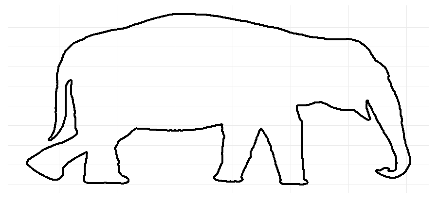

## Math Projects

**Project description:** Fun and/or interesting projects during my mathematics studies.

### Fitting an Elephant

> With four parameters I can fit an elephant, and with five I can make him wiggle his trunk.
>
> -- <cite>John von Neumann</cite>

Fitting curves with increasing deegrees of freedom using Fourier Descriptors. In this case I fit an elephant, but yes, this works for arbitrary curves!

|  | 
|:--:| 
| *1 degree of freedom* |

|  | 
|:--:| 
| *12 degrees of freedom* |

|  | 
|:--:| 
| *87 degrees of freedom* |

|  | 
|:--:| 
| *1000 degrees of freedom* |

### Kalman-Bucy Filter

### Frequency Analysis

|  | 
|:--:| 
| *frequency spectrum extracted from a short audio file* |

### Playing with Mathematical Curves

|  | 
|:--:| 
| *playing with the parameters of the Koch snowflake* |

The [fundamental theorem of curves](https://en.wikipedia.org/wiki/Fundamental_theorem_of_curves) says that a curve is basically completely determined by it's curvature. The following "artwork" has been constructed using a randomly generated curvature.

|  |
