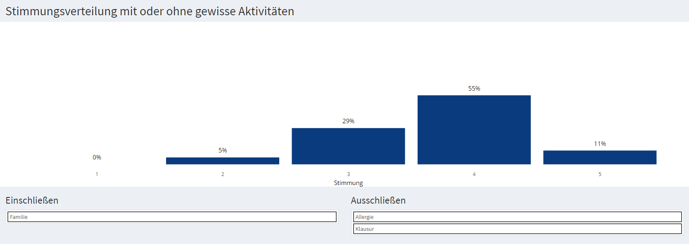

## Personal Dashboard

I've been tracking my mood, activities and location using <a href="https://daylio.net/" target="_blank" rel="noopener noreferrer">Daylio</a> and the Google Maps Timeline for a couple of years and visualized and analyzed this data. For this purpose, I have developed a R Shiny app of which I am sharing a small excerpt with partially anonymized data.

### Activity Correlation

|  | 
|:--:| 
| *simulation of a physical network of activities where correlation corresponds to bond strength and color corresponds to correlation to mood* |

|  | 
|:--:| 
| *correlation of activities on consecutive days* |

### Mood Distribution

As understanding my own mood is the main focus of this project, I have put a good portion of my effort in visualizing my mood distribution w.r.t. the activities I track.

|  | 
|:--:| 
| *mood distribution on days with or without selected activites* |

Apparently, sleep quality has a great influence on my mood. If I had a bad night of sleep, my mood is significantly worse than if I hadn't. However, the difference between a good night and an okayish night seems to be negligible.
|  | 
|:--:| 
| *mood distribution by sleep quality* |

### Visited Locations

|  | 
|:--:| 
| *some of the places I've visited in Hamburg* |
