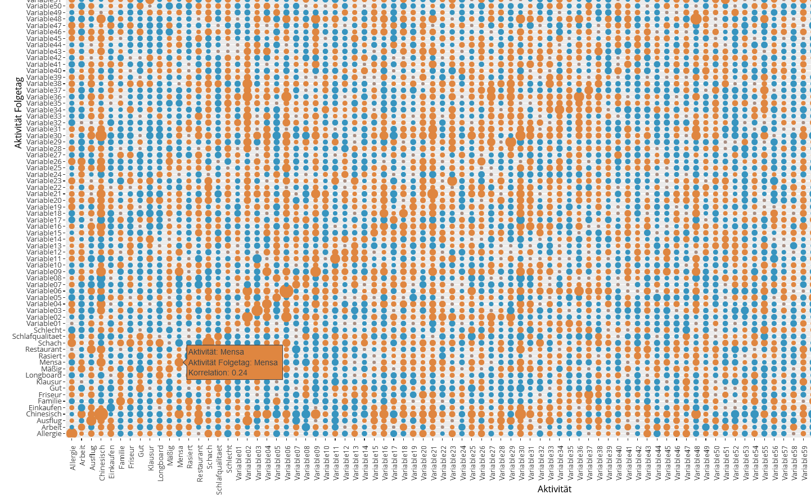
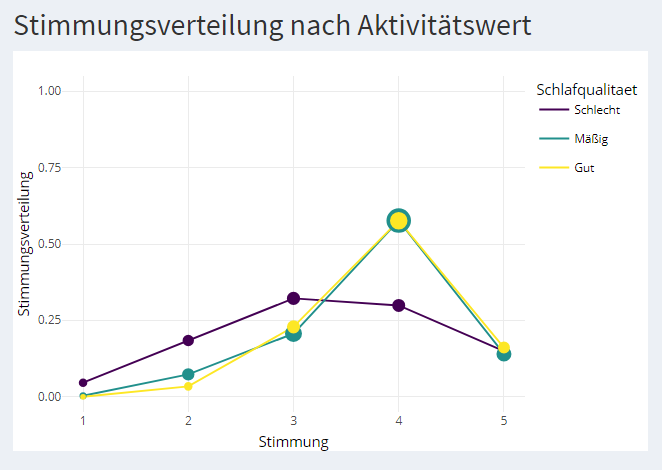

## Personal Dashboard

**Project description:** I've been tracking my mood, activities and location using <a href="https://daylio.net/" target="_blank" rel="noopener noreferrer">Daylio</a> and the Google Maps Timeline for a couple of years and visualized and analyzed this data. For this purpose, I have developed a R Shiny app of which I am sharing a small excerpt with partially anonymized data.

### Activity Correlation

|  | 
|:--:| 
| *simulation of a physical network of activities where correlation corresponds to bond strength and color corresponds to correlation to mood* |

|  | 
|:--:| 
| *correlation of activities on consecutive days* |

### Mood Distribution

|  | 
|:--:| 
| *mood distribution on days in which I visited my family and I did not experience allergy symptoms and had no exam* |

|  | 
|:--:| 
| *mood distribution by sleep quality* |

### Visited Locations

|  | 
|:--:| 
| *some of the places I've visited in Hamburg* |
