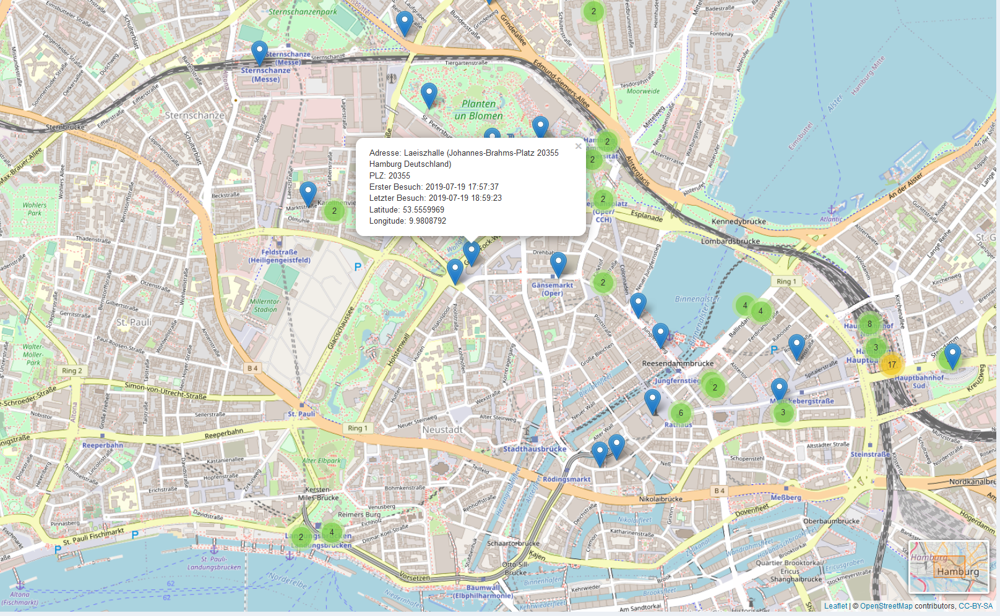

# Personal Dashboard

I've been tracking my daily mood, activities and location using <a href="https://daylio.net/" target="_blank" rel="noopener noreferrer">Daylio</a> and the Google Maps Timeline for a couple of years and visualized and analyzed this data. For this purpose, I have developed an R Shiny app of which I am sharing a small excerpt with partially anonymized data.

## Activity Correlation

|  |
|:--:|
| *simulation of a physical network of activities where correlation corresponds to bond strength and color corresponds to correlation to mood* |

|  |
|:--:|
| *correlation of activities on consecutive days* |

## Mood Distribution

As understanding my own mood is the main focus of this project, I have put a good portion of my effort in visualizing my mood distribution w.r.t. the activities I track.

|  |
|:--:|
| *mood distribution on days with or without selected activites* |

Apparently, sleep quality has a great influence on my mood. If I had a bad night of sleep, my mood is significantly worse than if I hadn't. However, the difference between a good night and an okayish night seems to be almost negligible.

<iframe src = "images/mood_distribution_by_sleep_quality.html" width="600" height="300"> </iframe>

## Visited Locations

Another part of my personal dashboard consists of visualizing the places that I've been to and the amount/frequency that I travel.

|  |
|:--:|
| *some of the places I've visited in Hamburg* |

## Multivariate Analysis

To find out which variables influence my mood the greatest, I fit a random forest and used a kind of relative frequency measure to interpret the importance of the individual variables. As my mood is, unsurprisingly, highly correlated with e.g. whether or not I feel happy or sad, I have removed all "mood" variables for this purpose.

The resulting most important variables are whether or not I am sick, I have spent time with my girlfriend and I have been physically active. Whether or not I have eaten at home or gone out seems to have surprisingly little impact.
As the random forest importance does not directly tell us if a variable's impact is positive or negative, I have also fit a linear model and looked at the estimated coefficients. And I have found out that being sick does indeed have a negative impact on my overall mood.

The reason for why I have not used machine learning techniques more extensively for this project is that the direction of causation is not quite clear: A model might find out that my mood is generally great when I spend time with my friends. However, I might cancel plans with them if I am not feeling well. Therefore, the prediction that my mood will be good tomorrow if I am going to spend time with friends might not be useful. The same applies to many activities such as doing chores, studying a language, dancing and so on. Also, some factors are not know beforehand such as quality of sleep.

[GitHub-project](https://github.com/NiklasvonM/Daylio)
