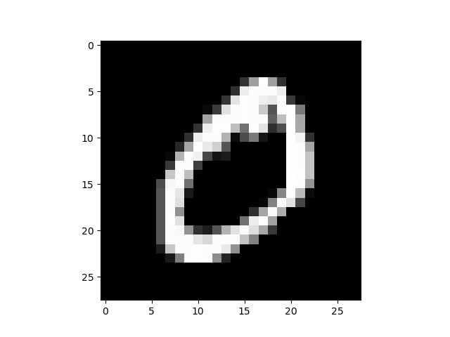

## Iterated Training With Self-labeled Data 

### Problem

Jurian Kahl, a friend of mine, and I explored the idea of training a neural network with data that has been labeled by itself. This idea may be useful when you have a large amount of data of which, however, only a small portion has been labeled.
It is expected that not enough predictions are correct when the model has only been trained with the small amount of initially labeled data. Therefore, we decided on a "democratic" bagging approach using an ensemble of multiple models: When all (or most of the) models agree on one label, we can say with some confidence that this label is probably correct. Therefore we then add those points the models agree on with their predicted (possibly incorrect) labels to our training data set.

### Methodology

|  |
|:--:|
| *example MNIST handwritten digit* |

We decided on using the <a href="http://yann.lecun.com/exdb/mnist/" target="_blank" rel="noopener noreferrer">MNIST</a> data set of handwritten digits and, for simplicity, an ensemble of four convolutional neural networks (of which two are respectively structurally equivalent) which are more or less of the following form:

```python
def get_model_conv_nn(
    input_shape,
    dropout = 0.2,
    activation = 'relu',
    solver = 'SGD',
    kernel_size = (3, 3),
    pool_size = (2, 2),
    padding = 'same',
    output_activation = "softmax",
    num_outputs = 10,
    filters = 16
):
    model = tf.keras.Sequential()

    # convolutional layers
    model.add(Conv2D(filters=32, kernel_size=kernel_size, input_shape=input_shape, padding=padding))
    model.add(Activation(activation))
    model.add(MaxPool2D(pool_size=(2, 2), strides=None, padding='valid'))

    model.add(Conv2D(filters=64, kernel_size=kernel_size, input_shape=input_shape, padding=padding))
    model.add(Activation(activation))
    model.add(MaxPool2D(pool_size=(2, 2), strides=None, padding='valid'))
    # fully connected layers
    model.add(Flatten())
    model.add(Dense(128, activation=activation))

    # output layer
    model.add(Dense(units=num_outputs, name="output", activation=output_activation))

    model.compile(
        optimizer=solver,
        loss=tf.keras.losses.CategoricalCrossentropy(from_logits=True),
        metrics=['categorical_accuracy']
    )

    return model
```

Of the 70,000 data points we used 5% for the initial training phase. Then we trained each model for 10 epochs and predicted the labels of the remaining data points. Afterwards, we added all data points for which all three models agreed and where each model was relatively confident in the prediction (> 95%) to the training set and repeated the previous step (with fresh, untrained models) until they agreed only agreed on a small number of predictions.

### Results

| Run | Training Data Size | Test Data Size | Number of Confident Predictions | Correct Predictions | Percent Correct |
|-----|--------------------|----------------|---------------------------------|---------------------|-----------------|
| 1   |  3,500             | 66,500         | 53,360                          | 52,966              | 99.3            |
| 2   | 56,860             | 13,140         |  3,525                          |  3,066              | 87.0            |
| 3   | 60,385             |  9,615         |  1,693                          |    933              | 55.1            |
| 4   | 62,078             |  7,922         |    969                          |    446              | 46.0            |

The models confidently agreed on a large amount of data after being trained on a small amount of training data with a low risk.
However, this risk increased drastically after the first iteration.

### Theoretical Evaluation

The above described "democratic" approach only works if the involved parties have different "beliefs". A mathematical intuition on why one might want to combine different estimators is the following: In parameter estimation, the error of an unbiased estimator is it's variance. And if you have $$n$$ estimators $$\theta_i$$ with the same variance, then

$$Var(\frac{1}{n} \sum_{i=1}^n \theta_i) = \frac{1}{n^2} n Var(\theta_1) = \frac{1}{n} Var(\theta_1)$$

if all $\theta_i$ are uncorrelated. However, our models were obviously not uncorrelated as they had (almost) the same structure and, perhaps even more importantly, were trained on the same data.

Some thoughts about the limiting behaviour: Assuming that our models form [consistent estimators](https://en.wikipedia.org/wiki/Consistent_estimator) (which is reasonable), it is to be expected that the risk of these models is in the limit not better than the models after the first training iteration:
Assume that $$0 < r_i < 1$$ is the models' risk before the $$i$$th iteration, i.e. $$1-r_i$$ is the share of correctly predicted labels at iteration $$i$$. Let $$n_0$$ be the size of the initial training set and $$n_i$$ be the size of the training set after the $$i$$th iteration, i.e. the models agreed on $$n_1-n_0$$ labels after the first training step.
Then, in the second iteration, the models are (in expectation) trained with $$n_0+(1-r_1)(n_1-n_0)$$ correct labels and $$r_1(n_1-n_0)$$ wrong labels. If the models were to learn this data perfectly, the new risk would be the ratio between the number of wrong labels in the data training set and the size of the whole data set. We get the recurrence equation

$$r_i = \frac{\sum_{j=1}^i r_{j-1}(n_j-n_{j-1})}{n_i}.$$

One can show via

$$r_{i+1}-r_i = \frac{\sum_{j=1}^{i+1} r_{j-1}(n_j-n_{j-1})}{n_{i+1}} - \frac{\sum_{j=1}^i r_{j-1}(n_j-n_{j-1})}{n_i}$$
$$\geq \frac{\sum_{j=1}^{i+1} r_{j-1}(n_j-n_{j-1})}{n_{i}} - \frac{\sum_{j=1}^i r_{j-1}(n_j-n_{j-1})}{n_i} = r_{i}\frac{n_{i+1}-n_i}{n_i} \geq 0$$

that the risks form an increasing sequence.

<!--- Die Abschaetzung ist sehr schwach.
Using [Chebyshev's sum inequality](https://en.wikipedia.org/wiki/Chebyshev%27s_sum_inequality), we even have


--->

This suggests that, unfortunately, our approach has poor convergence properties.

### Conclusion

Both the pratical results and theoretical considerations suggest that retraining on self-labeled data worsens the model's performance. We have reason to believe that this is true even if the structures of the models used in the ensemble differ from each other.

<!--[Repository](https://gitlab.com/nniklasvm/machine-learning-project-2020)--->
